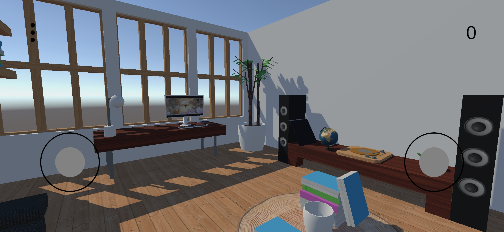
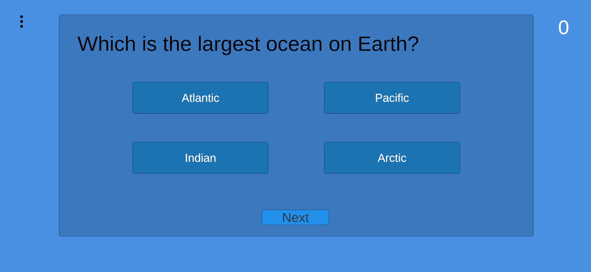
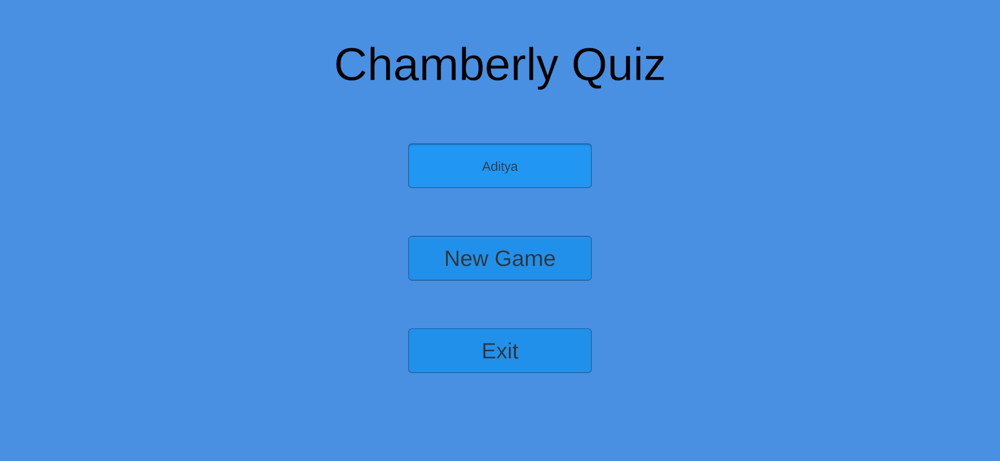

# 🎮 Chamberly Quiz Game

Welcome to **Chamberly Quiz Game**, a fun and interactive Unity-powered quiz game where you can explore a 3D environment, interact with objects, and test your knowledge with exciting quizzes!

---

## 🚀 Features

### 🕹️ **Interactive Gameplay**
- Wander around a beautifully crafted 3D environment and interact with objects like globes, books, and speakers to unlock quizzes!
- Each object brings a unique quiz theme to life.

### 📚 **Challenging Quizzes**
- Dynamic, multiple-choice quizzes sourced from **Firebase Firestore**.
- Topics range from Geography and Art to Science and Music.

### 👤 **Personalized Player Experience**
- **New Players**: Automatically create a profile and start fresh.
- **Returning Players**: Pick up where you left off, with scores and progress saved in **Firebase Realtime Database**.

### 🎨 **Smooth and Immersive UI**
- A clean main menu, intuitive quiz interface, and a responsive pause menu make gameplay seamless.

---

## 🌟 What Makes Chamberly Unique?

- **Interactive Objects**: Explore a room and interact with **5 exciting objects**:
  1. 📖 **Book**: Learn about literature and famous authors.
  2. 🌍 **Globe**: Test your geography skills.
  3. 💡 **Lamp**: Challenge yourself with science trivia.
  4. 🎨 **Painting**: Dive into art history.
  5. 🖥️ **Computer**: Discover Tech trivia.

- **Real-Time Updates**: Firebase integration ensures scores and progress are always synced.
- **Custom Player Profiles**: Unique IDs make every experience personal.
- **Seamless Gameplay Flow**: Enjoy a hassle-free gaming experience with interactive elements and smooth transitions.

---

## 🖼️ Screenshots

### 🏡 Gameplay Environment
Explore the vibrant 3D room where every object has a quiz waiting for you!


### ❓ Quiz Interface
Challenge your knowledge with fun and interactive quizzes!


### 🎉 Main Menu
Log in, start a new game, or pick up where you left off!


---

## 📲 Download and Play

### **Experience Chamberly Quiz Game Now!**
Download the APK and start exploring the quiz-filled world today!

👉 [**Download Chamberly Quiz APK**](Builds/android/1.apk) 👈

- **File Size**: ~50 MB
- **Platform**: Android
- **Version**: 1.0

---


### **Database Structure**

#### **Firestore** (Quizzes)
Houses all the quizzes in the `objects` collection:
```json
{
  "quizKey": {
    "questions": [
      {
        "question": "What is the capital of France?",
        "options": ["Paris", "London", "Berlin", "Madrid"],
        "correctOption": 0
      }
    ]
  }
}

```

#### **Realtime Database** (Player Data)
Tracks player progress and scores:
```json
{
  "players": {
    "playerId1": {
      "totalScore": 25,
      "scores": {
        "quiz1": 10,
        "quiz2": 15
      },
      "gameState": "in_game"
    }
  }
}
```
---
## 📧 Contact

For queries, feedback, or collaboration, reach out to:

- 🕸️**Website**: [aditya29mishra.web.app](https://aditya29mishra.web.app)
- 📭**GitHub**: [github.com/aditya29mishra](https://github.com/aditya29mishra)
- 📧**LinkedIn**: [linkedin.com/in/adityamishra29/](https://www.linkedin.com/in/adityamishra29/)
- 🤳**Gmail**: [adityarakeshmishra@gmail.com](adityarakeshmishra@gmail.com)
